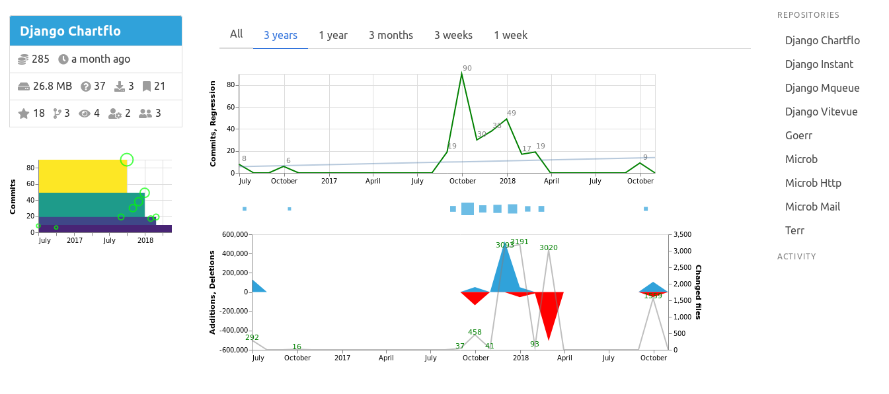

# Ghobserver

Monitor Github repositories data. This program fetches commits data for selected repositories at regular interval and make charts with it. Features:

- **View** repositories data with charts
- Desktop **notifications** on change

## How it works

The data is pulled from Github at regular interval from their api. It is stored in an Sqlite database. Charts are generated for each repository.

**Note**: this program is made to be run locally

## Install and configure

Install the python module:

   ```bash
   pip install ghobserver
   ```

Grab the binary release or compile from source.

Edit a `config.json` file next to the binary:

   ```javascript
{
"user": "github_username",
"pwd": "github_password",
"token": "github_personal_api_token",
"repositories": ["repo1", "repo2", "repo3"],
"external_repositories": ["username/reponame", "username/reponame"]
}
   ```

To get a personal api token check the [instructions](https://help.github.com/articles/creating-a-personal-access-token-for-the-command-line/)

Activate your python virtualenv if needed and run: `./ghobserver`

Go to `http://localhost:8447`

The api will be queried every 10 minutes for changes on repositories and activity feed. Notifications will popup
if anything has changed.

## Screenshot



## Todo

- [ ] Manage issues
- [ ] Manage pull requests
- [ ] Manage notifications
- [ ] Add datatables to commits view

## Techs and libraries

- [Sqlite](https://sqlite.org): the database
- [Vuejs](http://vuejs.org/): the frontend framework
- [Dataswim](https://github.com/synw/dataswim): data analytics in Python
- [Requests](https://github.com/requests/requests): fetch data in Python
- [Xorm](https://github.com/go-xorm/xorm): an orm in Go
- [Gorilla/Mux](https://github.com/gorilla/mux): http router in Go
- [Viper](https://github.com/spf13/viper): configuration management in Go
- [Notificator](https://github.com/0xAX/notificator): desktop notifications in Go
- [Notify2](https://bitbucket.org/takluyver/pynotify2): desktop notifications in Python
- [Gofeed](https://github.com/mmcdole/gofeed): atom feed parser in Go
- [Watcher](https://github.com/radovskyb/watcher): files watcher in Go
- [Terr](https://github.com/synw/terr): error management in Go
- [Arrow](https://github.com/crsmithdev/arrow): dates management in Python
